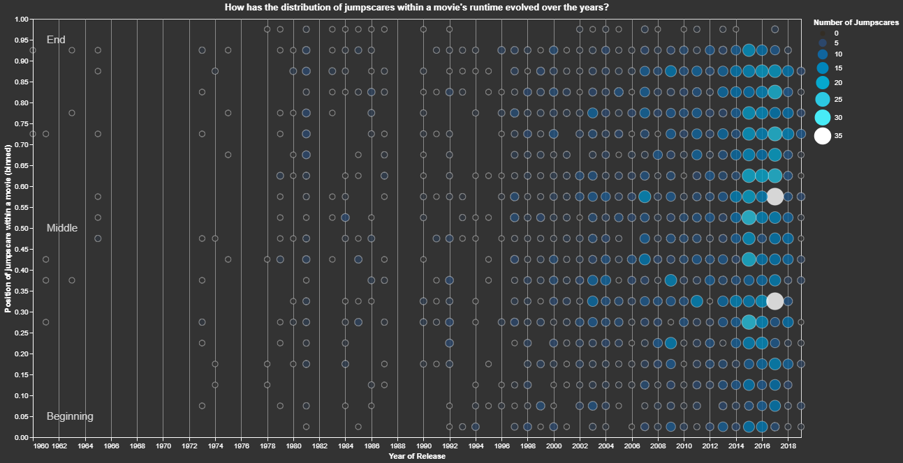

# dataviz-october-2019
Submission for the DataViz Battle in r/dataisbeautiful [October 2019 Battle](https://www.reddit.com/r/dataisbeautiful/comments/dei68x/battle_dataviz_battle_for_the_month_of_october/) by u/Ruoter. The dataset contains information about jumpscares in movies. 

Final submission visualization:

